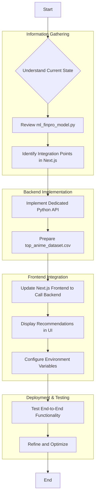

# AniSwipe Recommendation System Integration Plan

**Project Goal:** Integrate the `ml_finpro_model.py` for anime recommendations into the AniSwipe Next.js application and ensure the website functions as intended.

**High-Level Plan:**

1.  **Backend for ML Model:** Create a backend service (a dedicated Python API using Flask/FastAPI) to host and execute the `ml_finpro_model.py`. This is necessary because the Python model cannot run directly within the Next.js frontend.
2.  **Frontend Integration:** Modify the Next.js application to call this new backend service for recommendations and display them in the `app/swipe/page.tsx` and `components/recommendation-swiper.tsx` components.
3.  **Environment Configuration:** Securely store and access necessary API keys (MAL Client ID, Supabase keys) in the application's environment.
4.  **Testing and Refinement:** Thoroughly test the integrated system and refine as needed.

**Detailed Plan:**

**Step-by-Step Breakdown:**

1.  **Information Gathering & Analysis:**
    *   **Review `ml_finpro_model.py`:** Understand its inputs (MAL username, client ID) and outputs (list of recommended anime IDs). Note dependencies (`pandas`, `scikit-learn`, `requests`, `numpy`, `wordcloud`, `matplotlib`, `seaborn`). The model also reads `top_anime_dataset.csv`.
    *   **Identify Integration Points in Next.js:**
        *   `app/swipe/page.tsx`: This is likely where the swipe interface is, and where recommendations will be displayed.
        *   `components/recommendation-swiper.tsx`: This component probably handles the display logic for recommendations.
        *   `app/import-mal/actions.ts` and `app/import-mal/page.tsx`: These might be relevant for how the user's MAL profile is imported, which is crucial for the recommendation model.
        *   `lib/supabase.ts` and `lib/supabase/server.ts`: For Supabase client setup and server-side interactions.
        *   `.env`: For environment variables.

2.  **Implement Dedicated Python API:**
    *   Create a new directory (e.g., `api/`) for the Python Flask/FastAPI application.
    *   Move `ml_finpro_model.py` into this directory.
    *   Create a `requirements.txt` file with the necessary Python dependencies.
    *   Modify `ml_finpro_model.py` to be callable as a function within the Flask/FastAPI app, specifically the `generate_recommendations` function.
    *   Create a Flask/FastAPI app (`api/main.py`) that:
        *   Loads the `top_anime_dataset.csv` and initializes the TF-IDF vectorizer and matrix once on startup.
        *   Exposes a `/recommend` endpoint that accepts a MAL username.
        *   Calls the `generate_recommendations` function from `ml_finpro_model.py`.
        *   Returns the recommended anime IDs as a JSON response.

3.  **Prepare `top_anime_dataset.csv`:**
    *   The `ml_finpro_model.py` reads `top_anime_dataset.csv`. This file needs to be accessible by the Python backend. We will ensure this file is placed in the correct location for the Python API to access it (e.g., copied into the `api/` directory or accessed via a relative path).

4.  **Update Next.js Frontend:**
    *   **Create a new API utility:** In `lib/`, create a new file (e.g., `lib/recommendation-api.ts`) to handle API calls to the new Python backend.
    *   **Modify `app/swipe/page.tsx`:**
        *   Add logic to fetch recommendations from the new backend API when the user's MAL profile is available.
        *   Pass the fetched recommendations to the `components/recommendation-swiper.tsx` component.
    *   **Modify `components/recommendation-swiper.tsx`:**
        *   Update this component to receive and display the anime recommendations. This might involve fetching additional anime details (like name, image) from a public anime API (e.g., Jikan API, or even MAL's public API if allowed for display purposes) using the recommended anime IDs.

5.  **Environment Configuration:**
    *   Add the URL of the deployed Python backend API to the `.env` file (e.g., `NEXT_PUBLIC_RECOMMENDATION_API_URL`).
    *   Ensure `MAL_CLIENT_ID` and `MAL_API_BASE_URL` are securely passed to the Python backend (e.g., via environment variables on the backend server).

6.  **Testing:**
    *   Run the Next.js application and the Python backend.
    *   Test the MAL import functionality.
    *   Verify that recommendations are generated and displayed correctly.