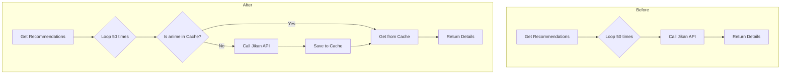

# Recommendation System Improvement Plan (v2)

## 1. Problem Analysis

Based on the application logs and code review, two primary issues have been identified in the recommendation system:

1.  **Excessive API Calls**: The system makes a new API call to Jikan for every single anime in a generated recommendation list (50 calls per request). This is inefficient and causes the application to be rate-limited, resulting in `Too Many Requests` errors.
2.  **Recommendation Quality**: The re-ranking formula gives too much weight to an anime's general popularity (`members` count). This causes mainstream anime (like "Haikyuu!!") to dominate the recommendations, even when they are not the best taste match for the user.

The discrepancy between the notebook output (sorted by `Overall Score`) and the live API output (sorted by `rerank_score`) confirms that the `rerank_score` is the root cause of the skewed recommendations in the production environment.

## 2. Proposed Solutions

### Solution Part 1: Implement Caching for API Requests

To solve the rate-limiting issue, we will introduce a caching mechanism. This will store the details of an anime after the first time it's fetched. Subsequent requests for the same anime will retrieve the data from the cache instead of making a new API call.

**Diagram of the Change:**

### Solution Part 2: Adjust the Re-Ranking Formula

To improve recommendation diversity and personalization, we will adjust the re-ranking formula to reduce the impact of raw popularity and increase the weight of the user's taste profile.

**Current Formula:**
`similarity * (score + 1) * log1p(members)`

**Proposed New Formula:**
`similarity^1.5 * (score + 1) * log(log1p(members))`

This change will provide more balanced and personalized recommendations.

## 3. Next Steps

1.  Receive approval for this plan.
2.  Switch to "Code" mode to implement the changes in `api/main.py`.