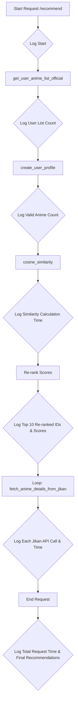

# Plan to Add Logging and Debug Recommendations

The goal is to add comprehensive logging to the `api/main.py` script to diagnose performance issues (a 2-minute delay) and recommendation discrepancies between the Python API and the Jupyter Notebook.

### 1. Introduce the `logging` Module

- **Action**: Import Python's standard `logging` module.
- **Configuration**: Configure it to output timed and formatted logs to the console. The format will be `%(asctime)s - %(levelname)s - %(message)s`.

### 2. Log the Pre-processing Step (`load_and_preprocess_data`)

- Log the start and end of this function to measure its total execution time.
- Log the shape of the dataframe after initial loading and after filtering to track data size.

### 3. Log the Recommendation Generation (`generate_recommendations_logic`)

- **User Anime List**: Log the number of anime fetched from the user's MAL profile to verify the input data.
- **User Profile Creation**: Log the number of anime from the user's list that are found in our database. This is key to understanding the "taste profile."
- **Similarity Calculation**: Log the time it takes to calculate the cosine similarity scores.
- **Top Recommendations (Before Re-ranking)**: Log the IDs of the top 10 anime based purely on similarity scores. This will help isolate if the issue is in the initial similarity or the re-ranking.
- **Top Recommendations (After Re-ranking)**: Log the IDs and the calculated `rerank_score` for the top 10 final recommendations. This is the most critical log for comparing with the notebook's output.
- **Jikan API Fetching**: Log each call to the Jikan API and the time it takes to confirm if this is the source of the major delay.

### 4. Mermaid Diagram of Logging Points

This structured logging will provide a clear, step-by-step view of the API's execution, making it much easier to identify bottlenecks and logical errors.